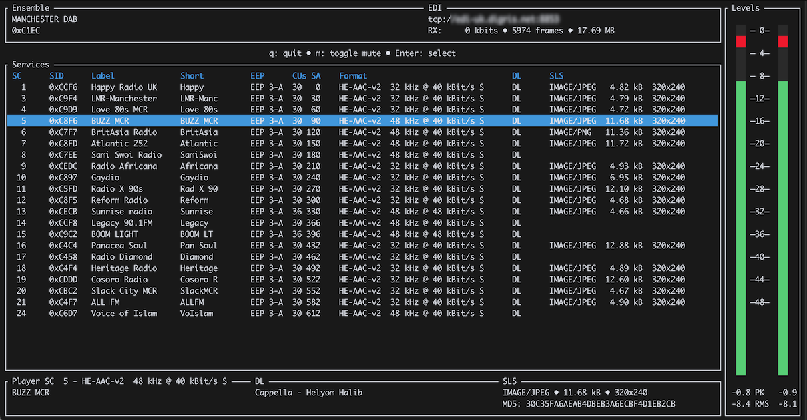
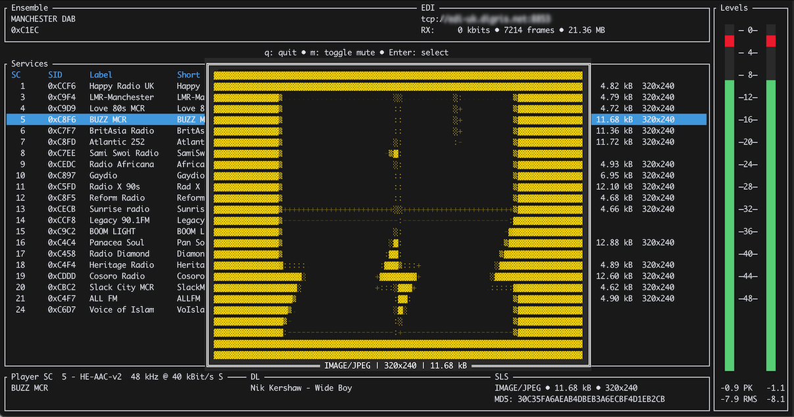

# EDInburgh

EDInburgh - your not so capital DAB experience ;) !

This project is an attempt to provide a simple and efficient toolchain to help introspecting and monitoring DAB+ infrastructure.

Currently it is focused on directly working (as the name implies ;) ) with EDI data - received via TCP/IP.

The same DAB core-library ([shared](shared/)) is used both in the native Rust [CLI](cli/) app - and in the [WASM](wasm/) build.

## Architecture

The architecture of EDInburgh is designed to be modular and extensible, allowing for easy integration of new features and standards.

### Core Components

- [Core Library](shared/): The foundation for all DAB-related functionality, implemented in Rust.
- [CLI Application](cli/): A command-line interface for interacting with the DAB core library, providing tools for monitoring and introspecting DAB+ infrastructure.
- [WASM Build](wasm/): A WebAssembly version of the DAB core library, enabling browser-based applications to leverage DAB+ functionality.
- [Web UI](web-ui/): A web-based user interface for playing DAB+ services and displaying DL and MOT information.

### Auxiliary Components

- [Frame Forwarder](frame-forwarder/): A service that extracts EDI Application Layer frames from the incoming stream and forwards them via WebSocket.
- [Ensemble Directory](ensemble-directory/): A service that scans EDI host and port-ranges for DAB+ ensembles, providing the result as a JSON API.

## Build

### Toolchain

To build the Rust binaries, Cargo is used.

[https://rustup.rs/](https://rustup.rs/)

```shell
curl --proto '=https' --tlsv1.2 -sSf https://sh.rustup.rs | sh
```

You also need "generic" build tools, like `gcc` etc.

```shell
# debian & co
sudo apt install build-essentials

# fedora & co
sudo dnf group install development-tools
```

To build the CLI ALSA dev libraries are needed:

```shell
# debian & co
sudo apt install libasound2-dev

# fedora & co
sudo dnf install alsa-lib-devel
```

Tu use `--features jack` / JACK audio output:

```shell
# debian & co
sudo apt install libjack-dev

# fedora & co
sudo dnf install jack-audio-connection-kit-devel
```

### Individual Components

See [Makefile](Makefile) for build details.

Each component can be built using the instructions from the corresponding `README.md` - or using each component's `Makefile`:

```shell
make build
# resp:
make build-release
```

### Build all Workspace Components

#### Dependencies / Tooling (WASM)

```shell
cargo install wasm-pack
rustup target add wasm32-unknown-unknown
```

#### Building

```shell
make build
# resp:
make build-release
```

### Build and Install Workspace Binaries

```shell
make install
```

This builds and installs:

- `edinburgh`
- `edinburgh-frame-forwarder`
- `edinburgh-ensemble-directory`

## Screenshots

### CLI / TUI





### Web UI


## Standards

EDInburgh (partly) implements the following DAB+ related ETSI standards:

### General

- ETSI EN 300 401 - DAB system
- ETSI TS 102 563 - DAB+ audio
- ETSI TS 102 693 - EDI

### Applications

- ETSI TS 102 980 - DL+
- ETSI EN 301 234 - MOT
- ETSI TS 101 499 - MOT SLS
