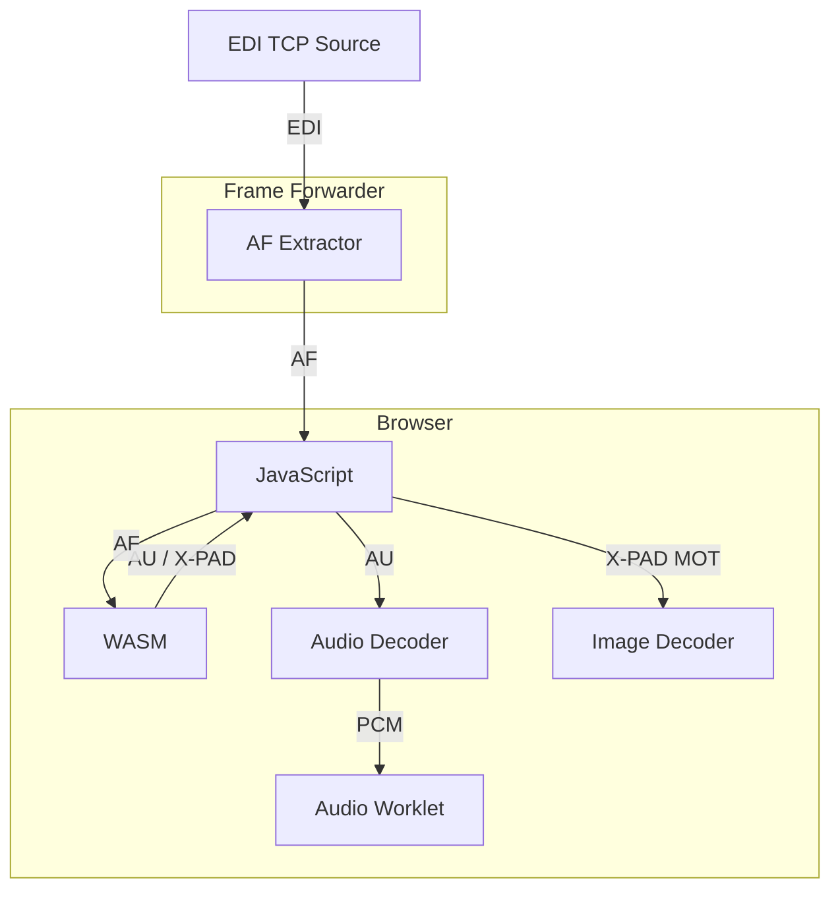

# EDInburgh

EDInburgh - your not so capital DAB experience ;) !

This project is an attempt to provide a simple and efficient toolchain to help introspecting and monitoring DAB+ infrastructure.

Currently it is focused on directly working (as the name implies ;) ) with EDI data - received via TCP/IP.

The same EDI core-library ([shared](shared/)) is used both in the native Rust [cli](cli/) app - and in the [WASM](wasm/) build.

## WASM Integration

