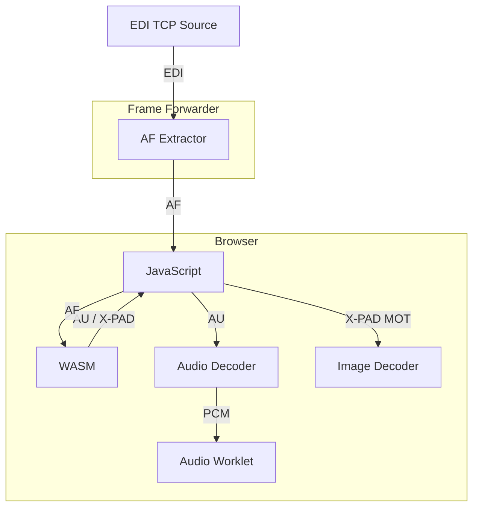

# EDInburgh

EDInburgh - your not so capital DAB experience ;) !

This project is an attempt to provide a simple and efficient toolchain to help introspecting and monitoring DAB+ infrastructure.

Currently it is focused on directly working (as the name implies ;) ) with EDI data - received via TCP/IP.

The same EDI core-library ([shared](shared/)) is used both in the native Rust [CLI](cli/) app - and in the [WASM](wasm/) build.

## Architecture

The architecture of EDInburgh is designed to be modular and extensible, allowing for easy integration of new features and standards.

### Core Components

- **[EDI Core Library](shared/)**: The foundation for all EDI-related functionality, implemented in Rust.
- **[CLI Application](cli/)**: A command-line interface for interacting with the EDI core library, providing tools for monitoring and introspecting DAB+ infrastructure.
- **[WASM Build](wasm/)**: A WebAssembly version of the EDI core library, enabling browser-based applications to leverage DAB+ functionality.

### Auxiliary Components

- **[Frame Forwarder](frame-forwarder/)**: A service that extracts EDI Application Layer frames from the incoming stream and forwards them via WebSocket.
- **[Ensemble Directory](ensemble-directory/)**: A service that scans EDI host and port-ranges for DAB+ ensembles, providing the result as a JSON API.

## Standards

EDInburgh (partly) implements the following DAB+ related ETSI standards:

### General

* ETSI EN 300 401 - DAB system
* ETSI TS 102 563 - DAB+ audio
* ETSI TS 102 693 - EDI

### Applications

* ETSI TS 102 980 - DL+
* ETSI EN 301 234 - MOT
* ETSI TS 101 499 - MOT SLS

## WASM Integration

