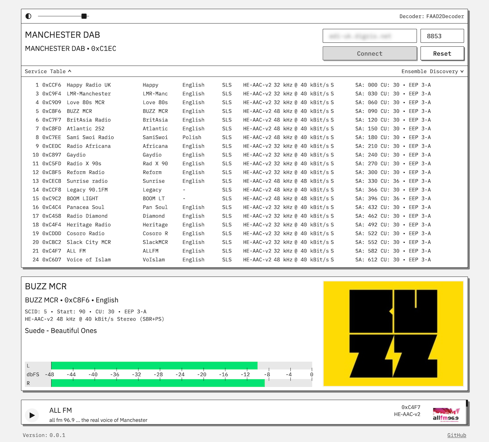

# EDInburgh Demo

Currently this contains a single docker image to run the EDInburgh web UI in demo-mode.

To see it in action, try the [demo](https://edinburgh-demo-845954871796.europe-west4.run.app/) running on GCP.

## Docker Build & Run

See [Makefile](Makefile) for details.

```bash
make build
```

```bash
# listens on port 9000
make run
```

## Screens



