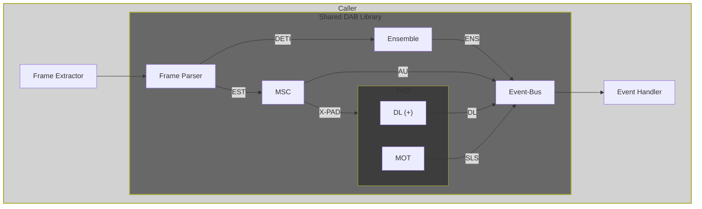

# EDInburgh DAB Library

Shared library code to be used in either native Rust or WebAssembly (WASM) environments.

## Architecture

The implementation could be debated ;) - on a bird's eye view, it works like this:

- Acquired DAB frames are fed into the processing chain
- When something "interesting" happens an event is emitted

### Flow

Not the best graph ;) - but to get a rough idea of the data flow:

