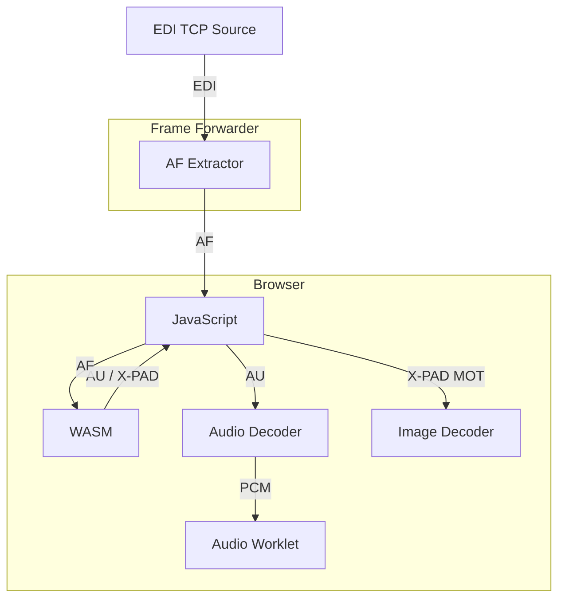

# EDInburgh Web-UI

## Running

### Run UI

```shell
bun install
bun dev # listens on 3001
```

```shell
# chrome wit separate profile (likely macOS only...)
open -na 'Google Chrome' --args --user-data-dir="${PWD}/tmp/chrome-profile" 'http://localhost:3001'
```

### Frame Forwarder

We can not connect to raw TCP streams from the browser (security reasons), so we need to run a AF frame forwarder that will listen on a TCP port and send the frames to the browser via WebSocket.

```shell
# assuming repository root:
cd frame-forwarder
cargo run
```

### Ensemble Directory (optional)

Provide discovered ensembles to the UI by running the directory service:

```shell
# assuming repository root:
cd ensemble-directory
cargo run -- --scan edi-uk.digris.net:8851-8860 --scan edi-fr.digris.net:8851-8860
```

## WASM Integration



## Screens


