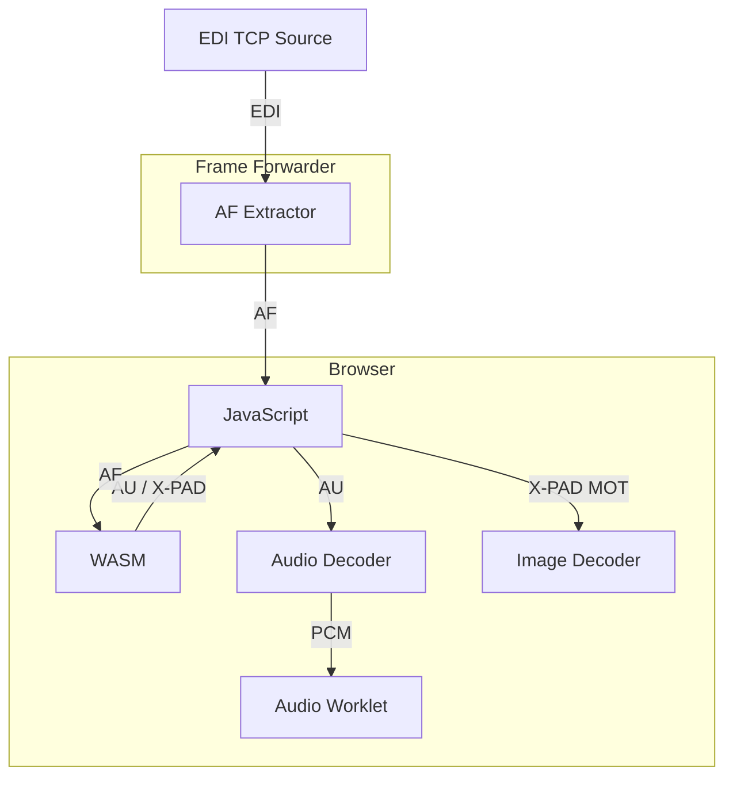

# EDInburgh Web-UI

## Running

### Run UI

```shell
bun install
bun dev # listens on 3001
```

> [!IMPORTANT]  
> Except for localhost the UI must be served via https due to browser security restrictions.

### Frame Forwarder

We can not connect to raw TCP streams from the browser (security reasons), so we need to run a AF frame forwarder that will listen on a TCP port and send the frames to the browser via WebSocket.

```shell
# assuming repository root:
cd frame-forwarder
cargo run
```

### Ensemble Directory (optional)

Provide discovered ensembles to the UI by running the directory service:

```shell
# assuming repository root:
cd ensemble-directory
cargo run -- --scan edi-proxy-1.digris.net:8101-8104 --scan edi-proxy-1.digris.net:8111-8114
```

### Configuration

The endpoints for the frame forwarder (`/ws`) and ensemble directory (`/ensembles`) can be set via `VITE_FRAME_FORWARDER_ENDPOINT` and `VITE_ENSEMBLE_DIRECTORY_ENDPOINT` environment variables respectively.

```shell
# example
VITE_FRAME_FORWARDER_ENDPOINT=wss://edi-player.digris.net/ws \
bun dev
```

## WASM Integration



## Screens


